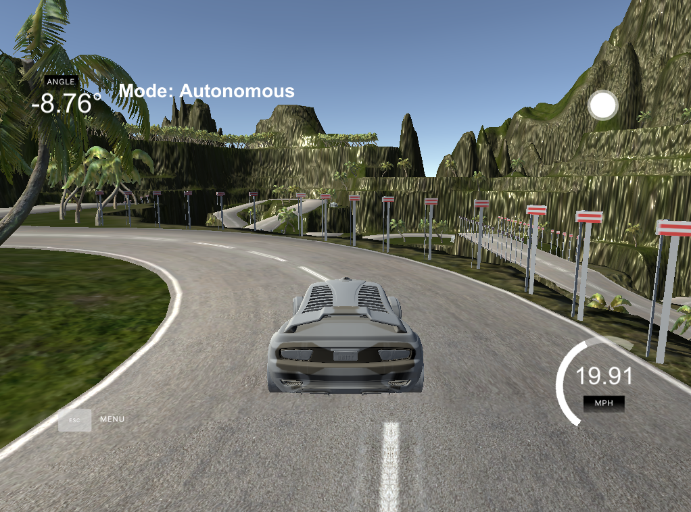

# Behaviorial Cloning Project

Overview
---
This repository contains files for the Behavioral Cloning Project.

In this project, I use what you've learned about deep neural networks and convolutional neural networks to clone driving behavior. You trained, validated and tested a model using Keras. The model outputs a steering angle to an autonomous vehicle in a simulator provided by Udacity.

To meet specifications, the project contains five files: 
* model.py (script used to create and train the model)
* drive.py (script to drive the car - feel free to modify this file)
* model.h5 (a trained Keras model)
* a markdown report writeup file 
* video.mp4 (a video recording of your vehicle driving autonomously around the track for at least one full lap)

It also contains two additional files:
* video_hard_track.mp4 (a recording with footage of my model driving on the second track in the simulator)
* P3.ipynb (a jupyter notebook file which was used for debugging of my model. It shows complete training log from Keras and some other data about my model)

### Dependencies
This lab requires:

* [CarND Term1 Starter Kit](https://github.com/udacity/CarND-Term1-Starter-Kit)

The lab enviroment can be created with CarND Term1 Starter Kit. Click [here](https://github.com/udacity/CarND-Term1-Starter-Kit/blob/master/README.md) for the details.

The following resources can be found in this github repository:
* drive.py
* video.py
* writeup_template.md

The simulator can be downloaded from the classroom. In the classroom, we have also provided sample data that you can optionally use to help train your model.
