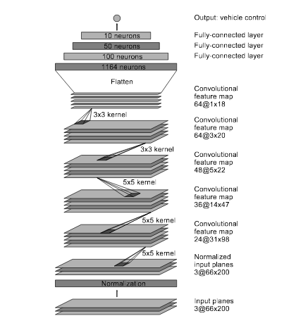
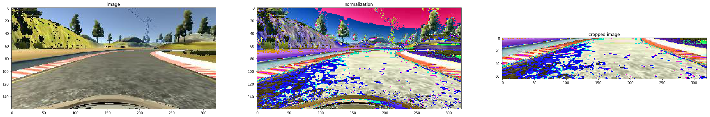
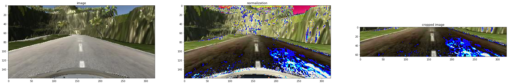
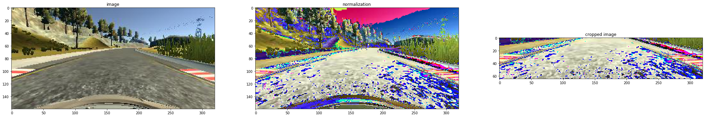

#**Behavioral Cloning** 

##Built by Dmitry Zaganich in August 2017.

---

**Behavioral Cloning Project**

The goals / steps of this project are the following:
* Use the simulator to collect data of good driving behavior
* Build, a convolution neural network in Keras that predicts steering angles from images
* Train and validate the model with a training and validation set
* Test that the model successfully drives around track one without leaving the road
* Summarize the results with a written report

## Rubric Points
###Here I will consider the [rubric points](https://review.udacity.com/#!/rubrics/432/view) individually and describe how I addressed each point in my implementation.  

---
### Files Submitted & Code Quality

####1. Submission includes all required files and can be used to run the simulator in autonomous mode

To meet specifications, the project contains five files: 
* model.py (script used to create and train the model)
* drive.py (script to drive the car - feel free to modify this file)
* model.h5 (a trained Keras model)
* a markdown report writeup file 
* video.mp4 (a video recording of your vehicle driving autonomously around the track for at least one full lap)

It also contains two additional files:
* video_hard_track.mp4 (a recording with footage of my model driving on the second track in the simulator)
* P3.ipynb (a jupyter notebook file which was used for debugging of my model. It shows complete training log from Keras and some other data about my model)

####2. Submission includes functional code
Using the Udacity provided simulator and my drive.py file, the car can be driven autonomously around the track by executing
 
```sh
python drive.py model.h5
```

####3. Submission code is usable and readable

The model.py file contains the code for training and saving the convolution neural network. The file shows the pipeline I used for training and validating the model, and it contains comments to explain how the code works.

### Model Architecture and Training Strategy

####1. Model architecture and preprocessing

My model is based on the Nvidia model. I've read an article from [Paul Heraty](https://slack-files.com/T2HQV035L-F50B85JSX-7d8737aeeb) which was suggested in project desription. He suggested to use Nvidia's pipeline, so I've decided to give it a try and it worked pretty well.



The data is normalized in the model using a Keras lambda layer and cropped using a Keras cropping2D layer to remove insignificant parts of input images such as landscape on top and car's part from bottom of the image. 

This is a visualization of my preprocessing pipeline applied to random images from the dataset:





The model includes 5 convolutional layers with RELU activations to introduce nonlinearity. The model also includes 4 fully connected layers. I slightly changed number of neurons comparing to the Nvidia's model, so the numbers of neurons are powers of two.

I also used hint from Yazeed Alrubyli in his article ["Behavioral Cloning: Tiny Mistake Cost Me 15 days"](https://becominghuman.ai/behavioral-cloning-tiny-mistake-cost-me-15-days-23dd13a3b525), so I changed image loading from cv2 lib to matplot lib, which greatly improved model learning process.  

####2. Attempts to reduce overfitting in the model

The model contains dropout layers after fully connected layers in order to reduce overfitting.
I also shuffled the training data, so the model learns how to drive and not just blindly copies moves from human driver. 

The model was trained and validated on different data sets to ensure that the model was not overfitting. The model was tested by running it through the simulator and ensuring that the vehicle could stay on the track.
I chose to split my data in the way so 80% of data became a training set and 20% of data became a validation set.

####3. Model parameter tuning

The model used an adam optimizer, so the learning rate was not tuned manually.
I played with a different number of epochs with my data and I found out that the model starts overfitting after 4 or 5 epochs. I chose 4 epochs for the final model. 

####4. Appropriate training data

Training data was chosen to keep the vehicle driving on the road.
From the beginning of this project, I wanted to make a model which is able to successfully drive both tracks from the simulator. I used test data from lectures which gave me 8036 images with steering angles from the first track. When I recorded data only from the second track. I recorded driving forward and backward on the second track, which gave me additional 11071 images with steering angles. I also recorded a smaller dataset with recovery measures, so the model learned how to get back to the road from left and right angles of the track. 
My total number of images in the dataset is 20204.

### Results

I was able to build a model which successfully passed both tracks. I also played for a bit with drive.py, trying different speed and I was surprised to see that my model performed pretty well even on a high speed, such as 30 km/hour which is 3 times more than the speed on which it was trained. Although the model performs well, definitely I should include throttle control to it in the future in order to successfully pass the tracks in optimal time with smart speed control. I also consider adding additional data preprocessing, such as lane detection and grayscaling the images to improve stability of the model.  

